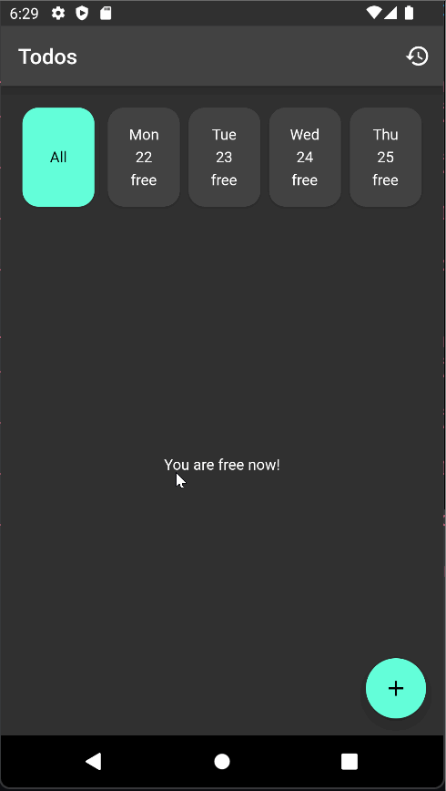

# Simple Todo App

## Packages

- [`intl`](https://pub.dev/packages/intl) - formatting stuff
- [`hive`](https://pub.dev/packages/hive) - local storage
- [`equatable`](https://pub.dev/packages/equatable) - compare dart object
- [`flutter_bloc`](https://pub.dev/packages/flutter_bloc) - state management
